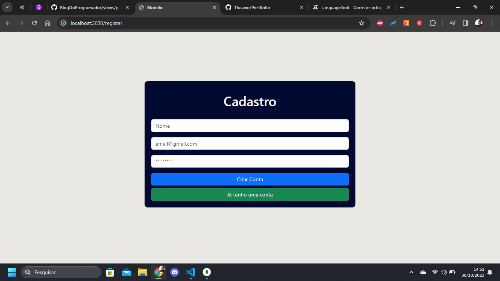

# LoginCadastro

# Sobre o Projeto
Projeto LoginCadastro foi criado pensando nos futuros projetos que iriam precisar de uma área de login e cadastro, foi usado criptografia para se ter mais segurança na senha dos usuários, e se caso precisar de um que necessite implementar uma área de login, já teria a base.

## Layout do projeto
 .png>) .png>)

## Back end
- Node.js
- Mongoose
- Express
- MongoDB
- Bcrypt

## Front end (Template Engine)
- ejs
- Bootstrap

## Como executar o projeto
### `npm run start` 
Executar app no modo de desenvolvimento.
Abra [http://localhost:3030/login](http://localhost:3030/login) para visualizar em seu navegador.

você também podera ver erros pelo console.